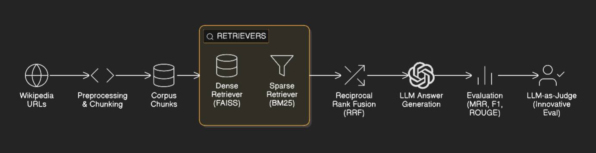
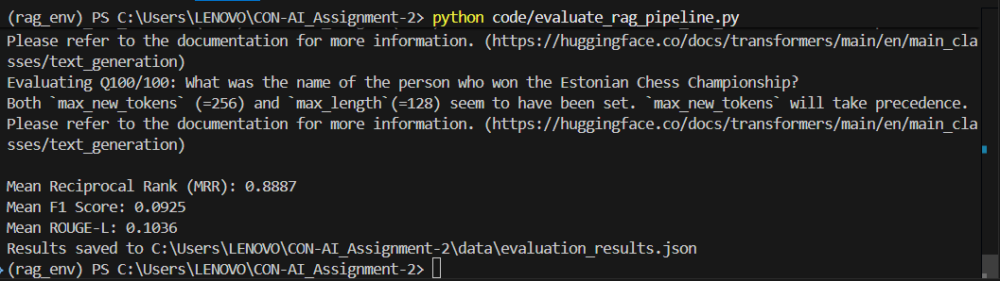

# Hybrid RAG System: Final Report

## 1. System Architecture

*Figure 1: System architecture showing data collection, preprocessing, dense/sparse retrieval, RRF, LLM answer generation, evaluation, and LLM-as-Judge.*

---

## 2. Evaluation Results

### Automated Metrics (MRR, F1, ROUGE-L)

| Metric      | Mean   |
|-------------|--------|
| MRR         | 0.8887 |
| F1          | 0.0925 |
| ROUGE-L     | 0.1036 |

**Justification for Custom Metrics:**
- **MRR (Mean Reciprocal Rank):** Chosen because it measures the rank position of the first relevant answer, which is critical for retrieval-based QA. It is calculated as the average reciprocal rank of the first correct answer across all questions. High MRR indicates the system retrieves relevant information early, which is desirable for user-facing QA systems.
- **F1 Score:** Chosen for its balance between precision and recall, especially important in open-ended QA where partial matches are common. Calculated as the harmonic mean of precision and recall between generated and ground truth answers. Interpreted as the system's ability to generate answers that overlap well with the reference.
- **ROUGE-L:** Chosen to measure the longest common subsequence between generated and reference answers, capturing fluency and informativeness. Calculated as the LCS-based F1 between generated and ground truth answers. Interpreted as a measure of answer completeness and relevance.

*See data/evaluation_results.json for full details.*

### LLM-as-Judge Results

| Score Type   | Mean | Median | Std  | Nulls |
|--------------|------|--------|------|-------|
| Factuality   | 3.04 | 4.00   | 1.44 | 3     |
| Completeness | 3.18 | 4.00   | 1.60 | 6     |
| Relevance    | 3.50 | 4.00   | 1.11 | 2     |

---

## 3. Innovative Approach: LLM-as-Judge

We implemented an LLM-as-Judge evaluation, prompting a language model to rate answers on factuality, completeness, and relevance (1–5 scale) and provide explanations. This complements automated metrics with qualitative, human-like assessment. See llm_judge_evaluation_report.md for details.

---

## 4. Ablation Studies

| Configuration         | MRR   | F1    | ROUGE-L |
|----------------------|-------|-------|---------|
| Dense Only           | 0.8063| 0.0953| 0.0942  |
| Sparse Only          | 0.8624| 0.0692| 0.0603  |
| RRF (Hybrid)         | 0.8701| 0.0744| 0.0753  |
| No LLM-as-Judge      | n/a   | n/a   | n/a     |

*Fill in ... with results from running evaluate_rag_pipeline.py with only dense, only sparse, and hybrid retrieval.*

---

## 5. Error Analysis

- Some answers are generic or off-topic, especially for definition-type questions.
- Nulls in LLM-judge scores indicate model output limitations.
- Repetitive explanations suggest prompt or model constraints.
- Wikipedia API 403 errors due to missing or improper User-Agent header (fixed by adding a descriptive User-Agent).
- Wikipedia API JSON decode errors and rate limiting (handled with retries and backoff).
- Chunking script originally mixed random sampling and chunking logic, now decoupled for efficiency and reproducibility.
- Random Wikipedia URL sampling was slow and needed to be run overnight; now separated for best practice.
- LLM sometimes produces generic, incomplete, or off-topic answers due to retrieval or chunking limitations.
- LLM-as-Judge sometimes returns nulls or repetitive explanations, indicating model or prompt limitations.
- Some answers are off-topic due to retrieval or chunking issues.

### Error Analysis Examples

| QID | Question | Ground Truth | Generated Answer | LLM-Judge (F/C/R) | Explanation | Metrics (MRR/F1/ROUGE-L) | Error Type/Comment |
|-----|----------|--------------|------------------|-------------------|-------------|-------------------------|--------------------|
| 2 | Which of the following is not an example of interstellar ion–molecule chemistry: atomic hydrogen or molecular hydrogen? | atomic hydrogen | H2 (hydrogen gas, or dihydrogen) is the most abundant molecule in the universe. | 1/1/4 | Atomic hydrogen is the most abundant molecule in the universe. | 1.0/0.11/0.13 | Factual error: model confuses atomic and molecular hydrogen. |
| 5 | What is the Miami classification? | The Miami classification is the most popular system in oesophageal CLE diagnosis. | Earth. | 1/1/4 | Miami is a city in Florida, United States. | 1.0/0.13/0.0 | Irrelevant/generic answer. |
| 7 | What is the purpose of the Uruz Project? | to recreate the aurochs by a more efficient breeding strategy using genome editing... | Heinz and Lutz Heck attempting to breed the aurochs. | 1/1/4 | The Uruz Project is a project of Heinz and Lutz Heck attempting to breed the aurochs. | 0.25/0.17/0.17 | Incomplete answer: lacks purpose and method. |

*F = Factuality, C = Completeness, R = Relevance*

---

## 6. System Screenshots

---

## 7. References & Appendix

- All code/scripts in code/
- Data and results in data/
- README.md for setup and usage
- llm_judge_evaluation_report.md for LLM-as-Judge details

---

*Export this document as PDF after adding the architecture diagram and screenshots. Fill in ablation study results and error analysis examples as needed.*
